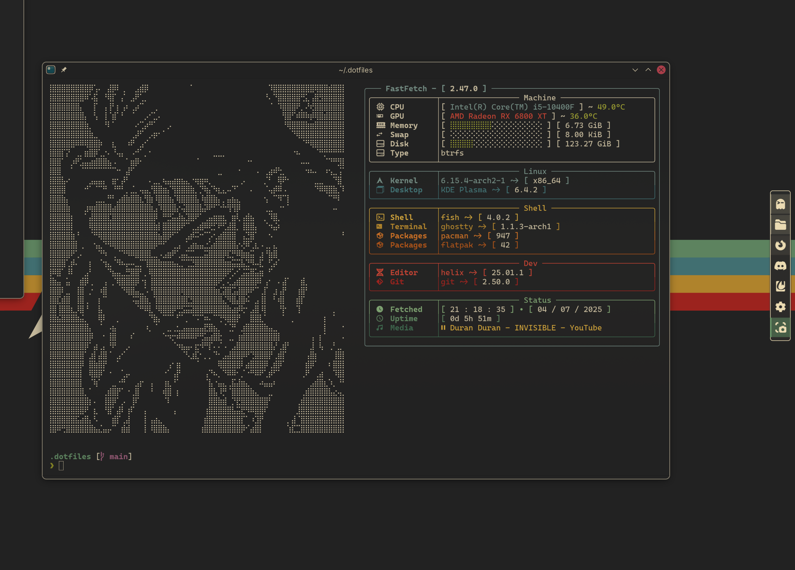

# Gruvbox Fastfetch & Ghostty Config

A gruvbox-themed configuration for Fastfetch and Ghostty terminal.



## Installation

1. Clone this repository:

   ```bash
   git clone https://github.com/arslan1510/gruvbox-fastfetch-ghostty
   cd gruvbox-fastfetch-ghostty
   ```

2. Run the install script:

   ```bash
   chmod +x install.sh
   ./install.sh
   ```

3. The script will:
   - Backup your existing configs (if any) to `~/.config_backup_YYYYMMDD_HHMMSS/`
   - Install the new configs to `~/.config/`
